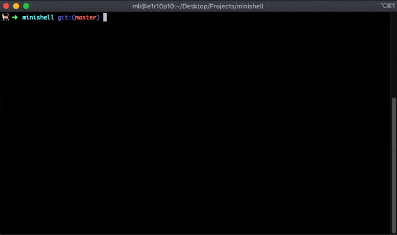

# at42minishell

This is a minishell, a 42 school project that reproduce a basic shell (CLI).

We use an AST! ([Abstract Syntax Tree](https://en.wikipedia.org/wiki/Abstract_syntax_tree))

We did all the bonuses except the `HERE_DOCUMENT` (`<<` operator).

Made by [charmstr](https://github.com/charMstr) and [me](https://github.com/mli42).

<p align="center">
        
</p>

## Usage
```shell
# Compile minishell with the Makefile
make -j4

# Start the shell
./minishell
```

## Features

- [x] Line editing (<kbd>←</kbd> / <kbd>→</kbd>)
- [x] History (<kbd>↑</kbd> / <kbd>↓</kbd>)
- [x] Copy (start: <kbd>CTRL</kbd>+<kbd>K</kbd> | stop : <kbd>CTRL</kbd>+<kbd>K</kbd>)
- [x] Past (<kbd>CTRL</kbd>+<kbd>P</kbd>)
- [x] Cut (start: <kbd>CTRL</kbd>+<kbd>K</kbd> | stop : <kbd>CTRL</kbd>+<kbd>L</kbd>)

- [x] Built-ins
    - `echo`
       - `-n` flag
    - `cd` (absolute/relative path + ~/-)
    - `pwd`
    - `export`
    - `unset`
    - `env`
    - `exit`
- [x] Launch binaries from `$PATH` (of course)

- [x] Semicolons (`;`)
- [x] Pipes (`|`)
- [x] Quotes (`"`, `'`)
- [x] Redirections (`>`, `>>`, `<`)
- [x] Signals (`CTRL-C` / `CTRL-\` / `CTRL-D`)
- [x] `AND` operator (`&&`), `OR` operator (`||`)
- [x] Parenthesis priority, creates a subshell (`(cmd)`)
- [x] Environment variables (ex: `$PATH`) + `$?`

- [x] Go start of line (<kbd>CTRL</kbd>+<kbd>A</kbd> or <kbd>HOME</kbd>)
- [x] Go end of line (<kbd>CTRL</kbd>+<kbd>E</kbd> or <kbd>END</kbd>)

- [x] Navigate between words (<kbd>CTRL</kbd>+<kbd>←</kbd> and <kbd>CTRL</kbd>+<kbd>→</kbd>)
- [x] Navigate between lines (<kbd>CTRL</kbd>+<kbd>↑</kbd> and <kbd>CTRL</kbd>+<kbd>↓</kbd>)

- [x] Multiline (giving a line with unclosed quote (`"`, `'`) or backslash (`\`) prints a PS2 until the line is finished)
- [x] Pathname expansion. Wildcard `*` (unquoted)

- [x] Update `SHLVL`, the prompts `PS1` and `PS2`
- [x] Ambiguous Redirections

## Main behavior of the minishell:

I] Get the next command line:

*   The terminal is put in raw mode in order to have an exact bash-like input interface.

II] Tokenisation (aka Lexing):

1) Create tokens with the Lexer (lexical analizer).

If the user's input isn't finished (unmatching quotes or parenthesis, backslash): prompt a PS2 until it's ok.

2) Categorizing the tokens as we create them from left to right.

III] Parsing:

*   Process the tokens according to a grammar and builds an AST of all the commands to run.

Thanks to the operators, we can identify the beginning and end of jobs.

IV] Word expansion:

1) Tild expansion (`~`) is done at the beginning of a potential path, or after
the first '=' sign that is in between a label=value pattern:
```bash
$ echo salut=~:~/Projects:~/hey # => salut=/HOME/charmstr:/HOME/charmstr/Projects:/HOME/charmstr/hey
```

2) Parameter expansion. ex:`$PWD` becomes `/home/...`

3) Field splitting, applied to the parameter expansion, only if in an unquoted section of text.
```bash
$ export foo="one       two"
$ echo $foo # Spaces are removed, expansion got split in two: one two
$ echo "$foo" # Spaces aren't removed. still one unique string: one      two
```
note: new strings that comes from an expansion are marked as protected against late quote removal.

4) Pathname expansion
```bash
$ ls # foo foobar foobar2
$ echo fo* # -> foo foobar foobar2
```
note:	it only applies if the `*` is unquoted, unescaped, etc.

5) Quote removal

V] Redirections are performed if necessary.

*  They are separated from the argv, but kept in the order of appearance. Redirecting stdin and stdout.

VI]	Commands are executed. A new prompt is displayed.
